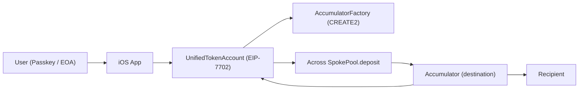

Hack Money

Architecture Diagram

Implementation Checklist
- Define UniversalIntent + ChainAction schema (chainId-scoped actions).
- Implement Simple7702Account with intent verification + chain-scoped execution.
- Implement GlobalAccumulator (deterministic address, accounting, EIP-1271 validation).
- Across V3 integration: attach intent+sig as message; recipient is accumulator.
- Emit MultiChainIntentExecuted with source chains/amounts for UI.
- Indexer/UI: hide internal transfers; display consolidated event.
