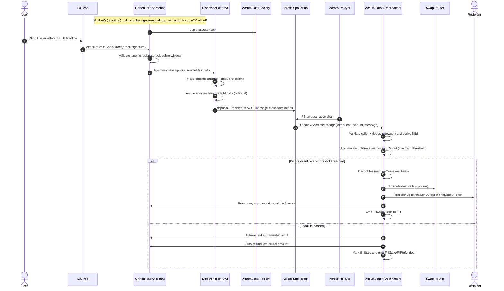

Hack Money Contracts

Architecture Diagram (Scatter → Gather → Execute)

```mermaid
sequenceDiagram
    autonumber
    actor User
    participant App as iOS App
    participant UA as UnifiedTokenAccount
    participant D as Dispatcher (in UA)
    participant AF as AccumulatorFactory
    participant SP as Across SpokePool
    participant R as Across Relayer
    participant ACC as Accumulator (Destination)
    participant DEX as Swap Router
    actor RCPT as Recipient

    Note over UA: initialize() (one-time): validates init signature and deploys deterministic ACC via AF
    UA->>AF: deploy(spokePool)

    User->>App: Sign UniversalIntent + fillDeadline
    App->>UA: executeCrossChainOrder(order, signature)
    UA->>UA: Validate typehash/signature/deadline window
    UA->>D: Resolve chain inputs + source/dest calls
    D->>D: Mark jobId dispatched (replay protection)
    D->>D: Execute source-chain preflight calls (optional)
    D->>SP: deposit(... recipient = ACC, message = encoded intent)

    R->>SP: Fill on destination chain
    SP->>ACC: handleV3AcrossMessage(tokenSent, amount, message)
    ACC->>ACC: Validate caller + depositor(owner) and derive fillId
    ACC->>ACC: Accumulate until received >= sumOutput (minimum threshold)

    alt Before deadline and threshold reached
        ACC->>ACC: Deduct fee (min(feeQuote,maxFee))
        ACC->>DEX: Execute dest calls (optional)
        ACC->>RCPT: Transfer up to finalMinOutput in finalOutputToken
        ACC->>UA: Return any unreserved remainder/excess
        ACC->>ACC: Emit FillExecuted(fillId,...)
    else Deadline passed
        ACC->>UA: Auto-refund accumulated input
        ACC->>UA: Auto-refund late arrival amount
        ACC->>ACC: Mark fill Stale and emit FillStale/FillRefunded
    end
```
