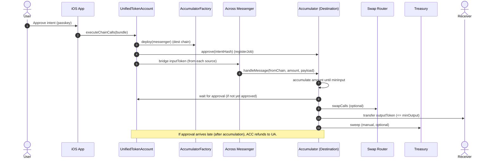

Hack Money Contracts

Sequence Diagram (Scatter → Gather → Execute)

```mermaid
sequenceDiagram
    autonumber
    actor User
    participant App as iOS App
    participant UA as UnifiedTokenAccount
    participant AF as AccumulatorFactory
    participant M as Across Messenger
    participant ACC as Accumulator (Destination)
    participant DEX as Swap Router
    participant TRE as Treasury
    actor Receiver

    User->>App: Approve intent (passkey)
    App->>UA: executeChainCalls(bundle)
    UA->>AF: deploy(messenger)  (dest chain)
    UA->>ACC: approve(intentHash)  (registerJob)
    UA->>M: bridge inputToken (from each source)

    M->>ACC: handleMessage(fromChain, amount, payload)
    ACC->>ACC: accumulate amount until minInput
    ACC->>UA: wait for approval (if not yet approved)

    ACC->>DEX: swapCalls (optional)
    ACC->>Receiver: transfer outputToken (<= minOutput)
    ACC->>TRE: sweep (manual, optional)

    Note over ACC,UA: If approval arrives late (after accumulation), ACC refunds to UA.
```
