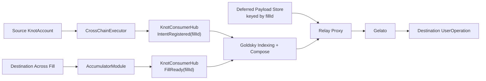

# Goldsky Compose Architecture

## Status

**Planned architecture adjustment.** V2 contract modularization remains the target, and cross-chain deferred-intent orchestration is moving toward a hub-driven workflow coordinated by Goldsky.

This document explains:

- why Goldsky was introduced
- why the original reservation-hook model was not sufficient on its own
- how `KnotConsumerHub` becomes the canonical orchestration surface for all `KnotAccount`s
- what remains onchain vs offchain
- how Goldsky Compose should be structured so it stays an orchestrator rather than becoming protocol state

## Why Goldsky Was Introduced

The current direct-to-account accumulator model solves local account liveness:

1. fills land directly in the account
2. `AccumulatorModule` tracks fill progress locally
3. `executeIntent` either executes with the funds still present or drops the fill cleanly

That solves the reservation/hook failure mode, but it does not solve deferred execution orchestration.

The protocol still needs a global observer that can:

- notice source-chain dispatch registrations
- notice destination `FillReady` transitions across all accounts
- correlate those events with stored deferred destination `UserOperation`s
- trigger relay submission without turning the backend into the protocol brain

Goldsky is introduced to own that orchestration and indexing layer.

The goal is not to replace protocol state or durable storage with Goldsky. The goal is to give Knot a coherent operational stack:

- `KnotConsumerHub` as the canonical protocol event surface
- Goldsky as the global indexing and workflow layer
- Gelato as bundler/paymaster and transaction submission path

In short:

- modules still own account-local correctness
- `KnotConsumerHub` is the global event bus
- Goldsky Compose is the coordinator
- Goldsky data pipelines can also replace generic wallet data APIs over time
- the backend is reduced to durable storage and narrow relay glue

## System View

## Architectural Boundary

Goldsky Compose should be the orchestration layer on top of the protocol, not part of the protocol.

The clean split is:

- `KnotAccount`, `CrossChainExecutor`, and `AccumulatorModule` own onchain truth.
- `KnotConsumerHub` is the canonical event surface.
- Goldsky Compose watches the hub and correlates lifecycle by `fillId`.
- durable storage keeps the deferred destination payload keyed by `fillId`.
- Gelato remains the execution rail for destination `UserOperation`s.
- the relay proxy stays narrow: authenticated lookup, provider passthrough, and later operational control endpoints.

This means Goldsky is responsible for detecting and triggering work, but not for creating protocol truth.

## The Two High-Severity Constraints

The original hook-enforced reservation model ran into two difficult issues that were not cleanly solved by small local patches.

### 1. Over-reservation Can Brick The Account

If reservation state is incremented by the callback's claimed `amount` rather than the account's actual balance delta, non-standard tokens can poison reservation state:

- fee-on-transfer
- rebasing
- tokens with callback/accounting mismatch

That can leave `reservedByToken[account][token] > actual balance`.

If a hook is a hard post-execution invariant, the account can become unusable:

- normal sends revert
- recovery actions revert
- module management can revert
- funds are effectively locked until the shortfall is somehow repaired

This is a liveness failure, not just an accounting bug.

### 2. Unsolicited Fill Pollution Can Cause Gas DoS

If third parties can create reservation-bearing state by routing tiny fills into many output tokens, they can expand the reserved-token set without user consent.

The original hook iterated the full reserved-token list. If that list is attacker-influenced and unbounded, every future account execution inherits that cost.

That creates a second liveness failure:

- gas-heavy post-check
- execution reverts due to cost
- owner may lose the ability to move funds or clean up state

This is not just UX noise. It is a fund-locking griefing vector.

## Why These Are No Longer Solved In The Hub

Those issues are no longer handled through hub-side or orchestration-side activation.

The current model is simpler:

- no accumulator reservation hook
- no asynchronous reservation activation
- no source-commitment lane just to protect a soft pending intent
- no witness-heavy fill authorization path

Instead:

- local fill state stays inside `AccumulatorModule`
- user funds remain directly in the account
- `executeIntent` performs the final bounded solvency check
- if the funds are gone, the fill is dropped

This means the hub is not a security boundary for fill admission.
It is an orchestration boundary for deferred execution.

## Why Goldsky Is The Better System-Level Choice

Goldsky fits Knot's current needs better than the earlier CRE plan because it lines up with the services Knot already wants to consolidate:

- event indexing
- workflow composition
- future transactions and balance data infrastructure

### What Goldsky improves

- removes dependence on provider-specific webhooks for the orchestration loop
- lets Knot watch one canonical hub surface instead of every account individually
- gives one place to build `IntentRegistered -> FillReady -> relay` workflows
- can also support future migration away from generic transaction and balance APIs

### What Goldsky does not replace

- Goldsky is not the source of truth for fill state
- Goldsky is not the durable store for deferred `UserOperation`s
- Goldsky does not replace Gelato's bundler/paymaster role
- Goldsky should not be treated as the custody or execution layer

Protocol truth remains:

- account/module state onchain
- deferred execution payloads in durable storage
- actual transaction submission through Gelato

Goldsky sits in the middle as indexer and coordinator.

## Architectural Decision

Knot will introduce a canonical `KnotConsumerHub` that sits between all `KnotAccount`s and the external orchestration layer.

The hub is the global, permissionless coordination surface for cross-chain intents.

High-level roles:

- `KnotAccount` / modules:
  - validate users
  - dispatch source-chain bridge actions
  - track destination fills
  - expose local readiness signals
- `KnotConsumerHub`:
  - receives intent registrations and fill lifecycle notifications
  - emits canonical global events
  - provides a stable integration target for Goldsky
- Goldsky Compose / indexing:
  - watches the hub
  - correlates lifecycle events
  - triggers the next workflow step
  - can materialize transaction and balance data over time
- Gelato:
  - bundles and sponsors destination `UserOperation`s
  - remains the execution submission layer

## KnotConsumerHub

### Purpose

`KnotConsumerHub` is the protocol-level event and coordination contract for all accounts.

It exists to avoid the need for external services to:

- watch every account directly
- index fallback callbacks per-account
- maintain custom correlation logic outside the protocol surface

Instead, every account reports cross-chain lifecycle updates to one canonical hub.

### Required Properties

The hub should be:

- singleton
- permissionless to read
- globally indexable
- minimal in storage and logic
- idempotent on repeated notifications

The hub is not the executor of user funds. It is the canonical public coordinator.

## Proposed Lifecycle

### 1. Source dispatch registers the deferred intent

After `CrossChainExecutor.dispatch(...)` succeeds, the canonical `CrossChainExecutor` module notifies the hub and supplies the originating account.

The registration should bind:

- `fillId`
- source chain id
- destination chain id
- account
- expiration / fill deadline metadata

The hub emits `IntentRegistered`.

This is the first event Goldsky watches.

Implementation note:

- the hub authenticates the canonical executor singleton
- registration is idempotent per `(account, fillId)`
- the hub stores only the minimum registration bit required for replay-safe indexing

### 2. Deferred destination payload is stored durably

The full deferred destination `UserOperation` should live outside Goldsky, keyed by `fillId` or another immutable intent identifier.

Recommended split:

- metadata/index/status in a durable DB if needed
- full serialized `UserOperation` blob in Pinata or another durable object store

The hub only needs a compact reference, not the full payload.

In the current design, `fillId` is sufficient as the canonical protocol identity.
Storage systems can deterministically derive their own payload lookup key from `fillId`, so the hub does not commit to backend-shaped `payloadRef` metadata.

### 3. Destination fills accumulate locally

`AccumulatorModule.handleV3AcrossMessage(...)` continues to track destination fills locally at the account.

The current direct-to-account model keeps destination fill accounting local and does not require orchestration-side reservation activation.

### 4. Accumulator reports readiness to the hub

Once the local accumulator determines the threshold is met, the canonical `AccumulatorModule` notifies the hub with the account and canonical `fillId`.

The hub emits `FillReady`.

This is the global ready signal. External systems do not need to watch every account's accumulator events directly.

### 5. Goldsky orchestrates execution

Goldsky listens to the hub and reacts to:

- `IntentRegistered`
- `FillReady`
- optionally `IntentExecuted`, `IntentCancelled`, `IntentExpired`, `IntentFailed`

When `FillReady(fillId)` appears:

1. Goldsky resolves the deferred payload reference
2. Goldsky fetches metadata or calls a narrow relay endpoint if needed
3. Goldsky triggers relay submission through the chosen submission path

Goldsky should treat this as an idempotent workflow keyed by `fillId`, not as a fire-and-forget webhook.

The practical Compose job is:

- wait for source-side `IntentRegistered(fillId, ...)`
- wait for destination-side `FillReady(fillId, ...)`
- join both records by `fillId`
- resolve the deferred payload from storage or a narrow relay-proxy endpoint
- trigger submission exactly once for that ready state
- record submission status for retries and operational visibility

### 6. Gelato submits the destination `UserOperation`

Gelato remains a submitter, not the lifecycle coordinator.

Its responsibilities are intentionally narrow:

- receive the prepared destination `UserOperation`
- submit it to the destination chain / bundler
- return transaction or UserOp status

### 7. Final status is reported back to the hub

After successful execution, the canonical accumulator can notify the hub so the orchestration loop is observable and replay-safe.

Suggested terminal events:

- `IntentExecuted`
- `IntentExpired`
- `IntentCancelled`
- `IntentFailed`

Implementation note:

- the hub authenticates the canonical accumulator singleton for ready/executed/dropped/stale reports
- repeated reports of the same status are ignored
- conflicting later terminal reports are ignored rather than turned into a liveness hazard

## Global Interaction Model

The hub interaction is global by construction:

1. every `KnotAccount` installs the same hub address
2. source-chain dispatch calls the hub after registering a cross-chain intent
3. destination-chain accumulator/account calls the hub when local fill state becomes ready
4. Goldsky only watches the hub, not every account
5. relay/storage systems key everything by the same `fillId`

That gives Knot one canonical global pipeline instead of N per-account integrations.

## Goldsky Compose Responsibilities

Compose should own:

- indexing `KnotConsumerHub` events across supported chains
- correlating source dispatch and destination readiness by `fillId`
- materializing one operational record per `fillId`
- retry-safe workflow triggering
- status fan-out into relay submission and operational dashboards

Compose should not own:

- deferred payload storage
- fill authorization
- destination solvency checks
- protocol truth
- the only replay or recovery mechanism

If Compose misses a run, the system should still be recoverable from:

- hub events
- durable payload storage
- current onchain account/module state

That is the main architectural rule.

## Offchain State Model

The offchain orchestration record should be keyed by `fillId`.

Recommended materialized fields:

- `fillId`
- `account`
- `sourceChainId`
- `destinationChainId`
- `fillDeadline`
- `registeredAt`
- `readyAt`
- `submissionStatus`
- `submissionReference`
- `terminalStatus`

Suggested operational statuses:

- `registered`
- `ready`
- `submitted`
- `confirmed`
- `dropped`
- `stale`
- `failed`

These are operational statuses for Compose and relay glue. They are not the protocol source of truth.

## Relay Boundary

Goldsky should not construct provider-specific relay payloads itself if that logic is likely to grow.

The cleaner boundary is:

- storage is keyed by `fillId`
- relay proxy resolves the deferred payload for one `fillId`
- relay proxy passes through the provider-native JSON-RPC request to Gelato

That keeps:

- Goldsky focused on orchestration
- relay proxy focused on authenticated execution glue
- Gelato focused on execution

In other words, Goldsky should decide _when_ to relay, not own all the logic for _how_ to relay.

## Failure And Recovery Model

Goldsky must assume duplicate delivery, delayed delivery, and replay.

So the workflow should be:

- idempotent per `fillId`
- safe on repeated `IntentRegistered`
- safe on repeated `FillReady`
- safe on repeated relay status callbacks

Recovery should be possible by replaying hub events and re-querying payload storage for a specific `fillId`.

This is why Goldsky cannot be treated as the durable queue of record.

## Why This Is Cleaner Than Provider Webhooks

Using Alchemy-style webhooks plus a custom backend would still work, but the backend remains responsible for:

- indexing all lifecycle events
- correlating source dispatch with destination readiness
- deciding when to relay
- handling provider-specific event delivery assumptions

With the hub + Goldsky model:

- contracts expose a protocol-native coordination surface
- Goldsky handles orchestration and indexing
- Gelato handles execution submission
- the backend is reduced to storage and narrow relay glue

That is a cleaner separation of concerns.

## Known Goldsky Tradeoffs

Goldsky improves orchestration and data coherence, but it introduces real operational assumptions:

- workflow correctness still depends on an offchain coordinator
- missed or delayed runs must be replayable from hub events plus stored deferred payloads
- transaction and balance indexing quality depends on how Knot scopes watched accounts and tokens
- cross-chain balance infrastructure is still an application-owned data problem, not a free turnkey primitive

So the design should assume:

- Goldsky is not the durable queue
- missed or delayed runs must be replayable from hub events plus stored deferred `UserOperation`s
- the system may begin with known-account indexing rather than chain-wide generic wallet coverage

In other words:

- hub events are the replayable protocol surface
- storage is the durable source for deferred execution payloads
- Goldsky is the coordinator and indexer, not the database of truth

## Design Rules Going Forward

1. Do not let a missed Goldsky workflow run make an intent unrecoverable.
2. Keep deferred destination `UserOperation`s in durable storage outside Goldsky.
3. Use `KnotConsumerHub` as the only integration target for global orchestration.
4. Keep the hub minimal: identity, status transitions, and canonical events.
5. Keep account-local fill accounting and drop semantics in the modules.
6. Keep Gelato as the execution layer until Knot has a better bundler/paymaster replacement.
7. Build Goldsky data pipelines around known accounts first, then expand coverage only when product usage justifies it.

## Open Questions

- Should the hub store only status and references, or also enforce allowed lifecycle transitions?
- Should `FillReady` be emitted directly by the account and mirrored by the hub, or should the hub become the only canonical ready event?
- Should Goldsky call a narrow backend endpoint that returns exactly one deferred payload for one `fillId`, or should the relay pull directly from Pinata/storage?
- Which Goldsky dataset/pipeline boundaries should own future transaction history, native balances, and ERC-20 balance materialization?
